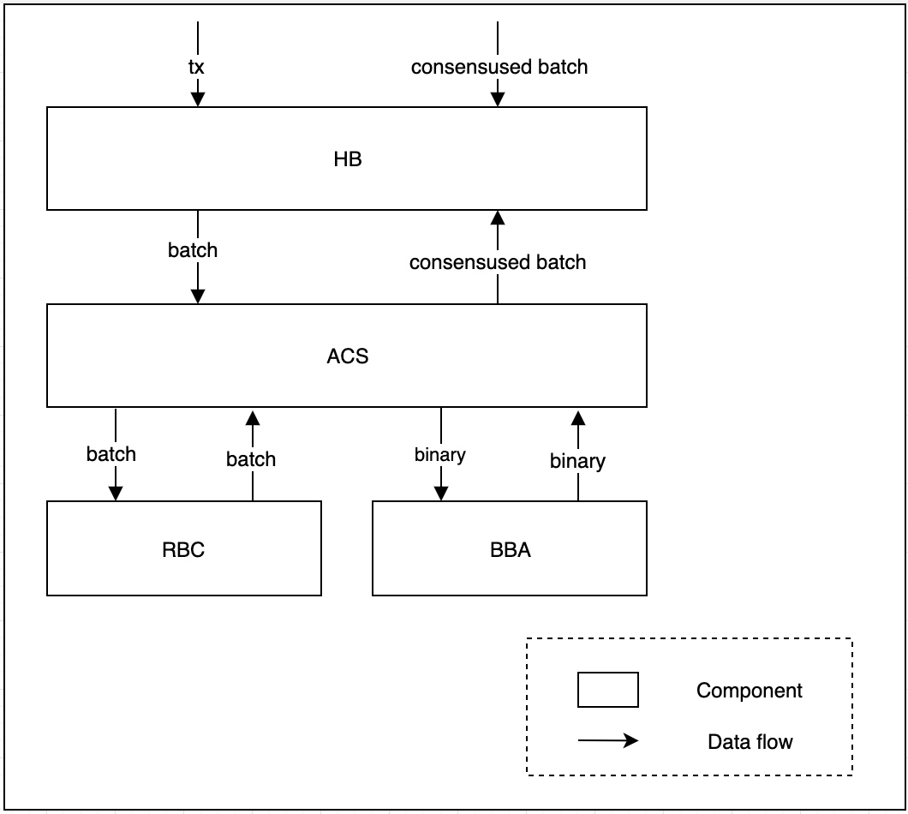
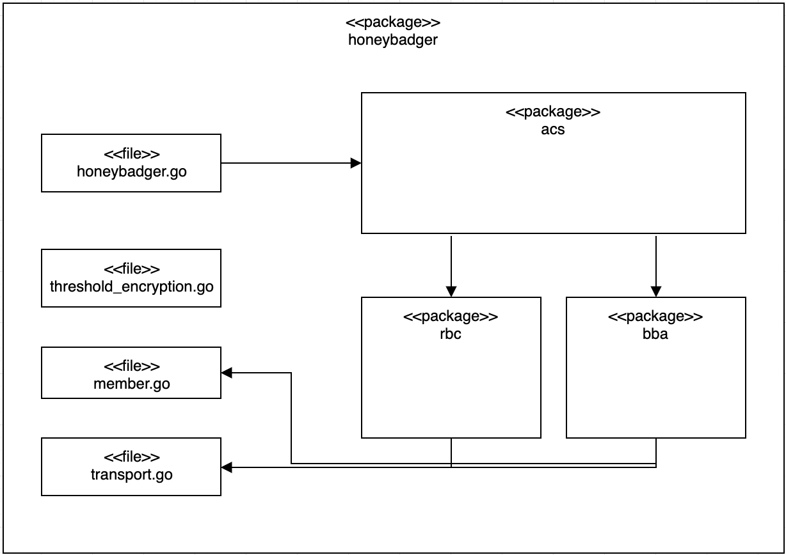

# Cleisthenes   

Cleisthenes is HBBFT(Honey Badger Byzantine Fault Tolerance) consensus library adaptable to any application.

## Documentation

More detail of each component is documented here

* HoneyBadgerBFT Overview **[[KO](./docs/HONEYBADGER-KO.md) / [EN]((./docs/HONEYBADGER-EN.md))]**
* Reliable Broadcast (RBC) **[[KO](./docs/RBC-KR.md) / [EN](./docs/RBC-EN.md)]**
* Byzantine Binary Agreement (BBA) **[KO / [EN]((./docs/BBA-EN.md))]**
* Threshold Encryption (TE) **[KO / [EN](./docs/THRESHOLD_ENCRYPTION-EN.md)]**

## Architecture

### Logical View

    	</img>

**HoneyBadger (HB)** receives transaction from Application and queuing them into its own buffer, **HB** also manages consensus epoch which helps to distinguish every consensus. Everytime new epoch starts, HB creates batch with its own transactions, then sends it to the **ACS** to consensus this batch and other nodes' batch.

**Asynchronous Common Set (ACS)** is main API of Honey Badger BFT where agreement takes place. ACS uses **RBC** and **BBA** to consensus its own node batch as well as other nodes' batch who joined to same network.

**Reliable Broadcast (RBC)** distribute single node's batch to the rest of the nodes in the network. The result of RBC is set of batches of all nodes in the network. RBC guarantees that every node gets the same output, event if the sender or other nodes try to sending different information to different nodes.

**Byzantine Binary Agreement (BBA)** determines whether or not a batch is included in the set of batches, based on a composite of votes from all nodes in the network. BBA is completed once more than 2/3 of the participating nodes agree on whether to include the batch in the set of batches.

### Module View

    	</img>

## Contribution
Contribution Guide
[CONTRIBUTION](CONTRIBUTING.md)

## CLA Hub

To get started, <a href="https://www.clahub.com/agreements/DE-labtory/cleisthenes">sign the Contributor License Agreement</a>.