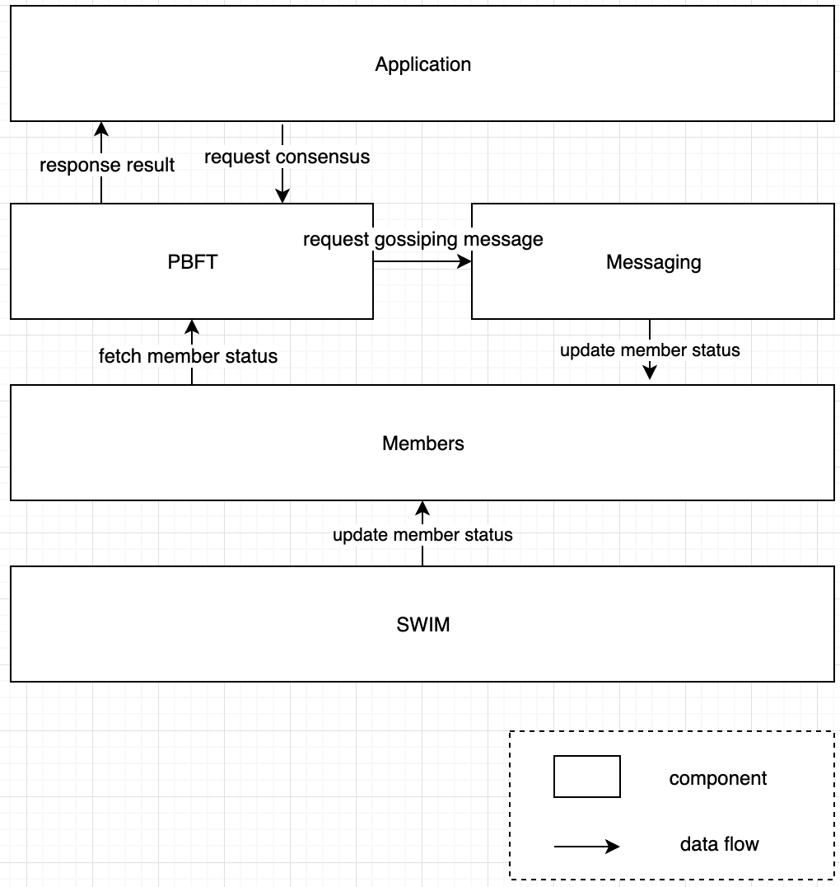

# Cleisthenes  

Cleisthenes is PBFT consensus library adaptable to any application.

## Architecture

### Logical View

    	</img>

**PBFT** basically communicate with **Application**. Whenever Application needs consensus with its network members, **Application** sends request to **PBFT**.

If one of nodes in the network need to gossiping message to the network such as notifing changed leader or broadcasting byzantine node, we can gossiping those messages through **SWIM**. 

**SWIM** gossips node's meta data such as whether this node is leader or not, participate in consensus or not and so on. And everytime node found that one of node changed, update states of **Node**. Whenever one of node in the network have some change of its health status, updates **Node**  states. 

**Node** manage all the nodes information participate in the network. Whether node is alive or not, whether it is leader node or whether it is participate in consensus. Also **Node** manage network policy such as who should be next leader, who should be participates in the next consensus.

### Contribution
Contribution Guide
[CONTRIBUTION](CONTRIBUTING.md)

### CLA Hub

To get started, <a href="https://www.clahub.com/agreements/DE-labtory/cleisthenes">sign the Contributor License Agreement</a>.