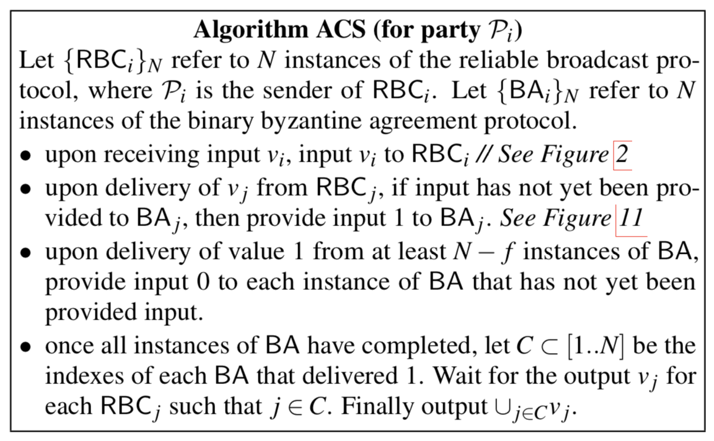
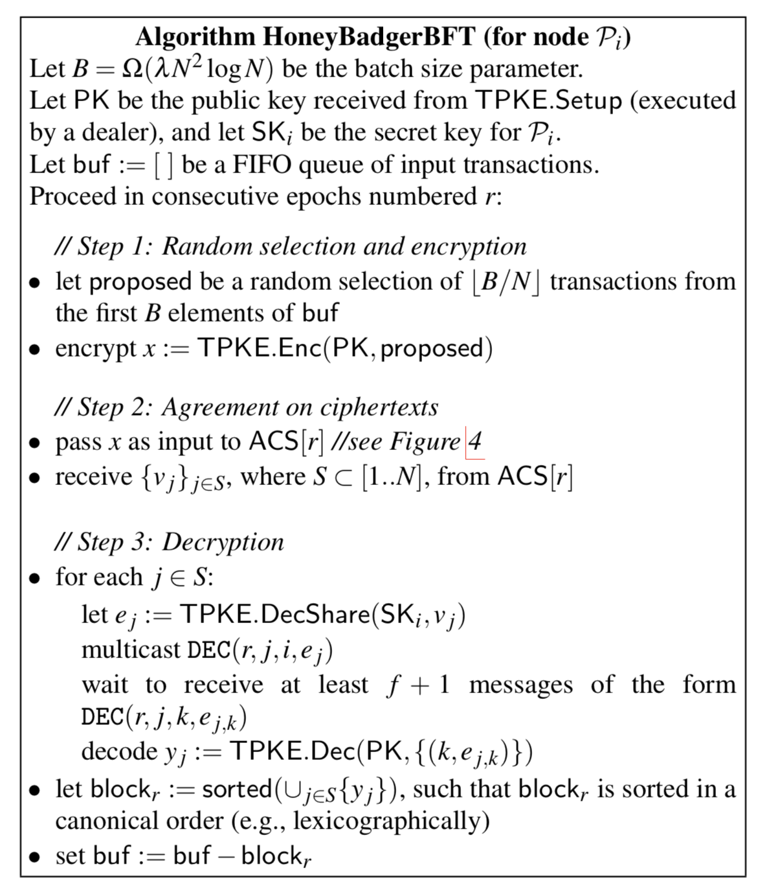
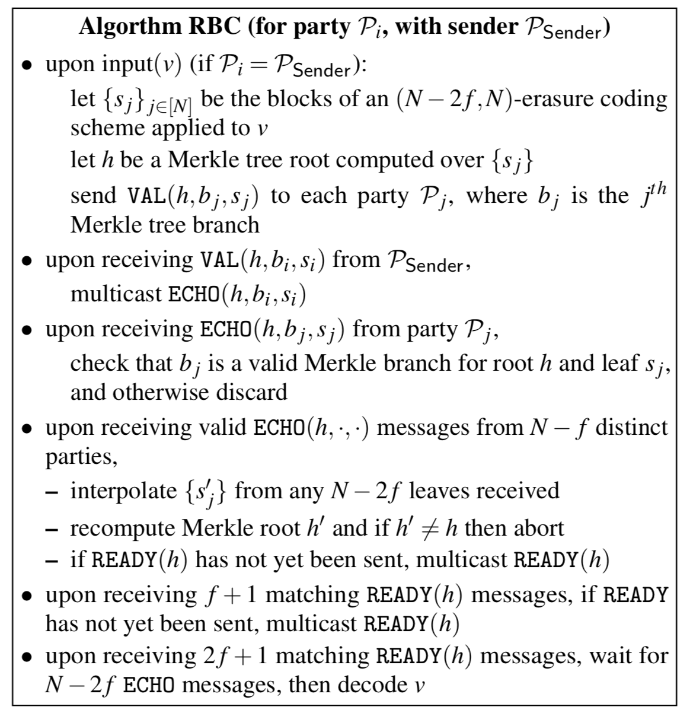
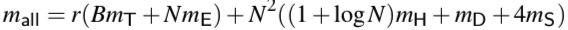
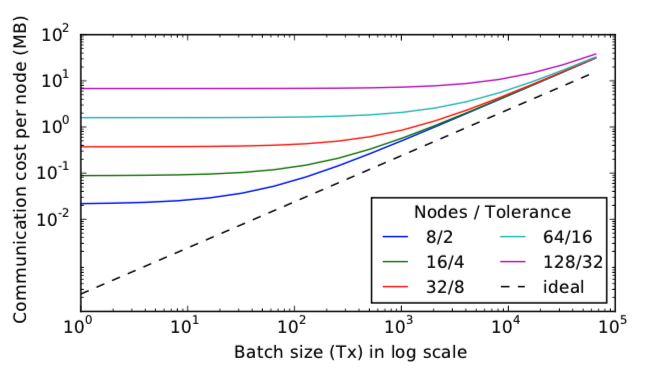
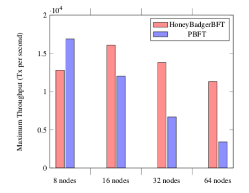

# HoneyBadegerBFT
### Introduction
Block-chain records every transaction which is made in network. 
All node in block-chain have to agree what transactions will be added to next block.
In this process, network must solve **Byzantine general problem**, PBFT or other several solution can solve it.
But PBFT has some problems like below.
* It uses **time-out**, but it is harmful for its performance.
* Suitable for small network because of heavy network overload.
* There is leader node, and it is not suitable for de-centralize.

*HoneyBadgerBFT* solves these problems like this.
* HBBFT does not use time-out, it is completely asynchronous.
* Less network overload than PBFT.
* No reader, all node are equal.

### HoneyBadgerBFT protocol
The messages in most BFT(Byzantine Fault Tolerance) system must arrive in fixed time out.
But time-out is not suitable for distributed system or block chain which works in unreliable network.
So HBBFT uses **asynchronous atomic broadcast protocol**.

#### Atomic broadcast protocol
Atomic broadcast protocol is defined as follows.
* Agreement : If any correct node outputs a transaction tx, then every correct node outputs tx.
* Total order : If one correct node has output the sequence of transactions <tx0, tx1, ..., txj> and another has output 
<tx0', tx1', ..., txj'>, then txi = txi' for i <= min(j, j').
* Censorship Resilience : If a transaction tx is input to N - f correct nodes, then it is eventually output by 
every correct node.

#### Asynchronous common subset

<The Honey Badger of BFT Protocols, 2016>

Asynchronous common subset(ACS) is defined as follows.
* Validity : If correct node outputs a set v, then |v| >= N - *f* and v contains the inputs of at least N - 2*f* correct nodes.
* Agreement : If a correct node outputs v, then every node outputs v.
* Totality : If N − *f* correct nodes receive an input, then all correct nodes produce an output.

#### Threshold encryption
*Threshold encryption* is the way that every node encrypts a message using master public key, and decrypts together. If `f + 1` nodes 
Once `f + 1` correct nodes compute and reveal decryption shares for a ciphertext, the plain-text can be recovered.
Until at least one correct node not reveals its decryption share, the attacker learns nothing about the plaintext.

#### HoneyBadgerBFT Algorithm

<The Honey Badger of BFT Protocols, 2016>

**Atomic Broadcast** is the most important feature of asynchronous common subset(ACS).
HBBFT sets batch policy for better scalability as follows.
1. B is batch size, and will commits Ω(B) transactions each epoch.
2. Each node submits `B / N` transactions in its queue.
3. To ensure that nodes propose mostly distinct transactions, HBBFT randomly selects these transactions from the first B in each queue.

Time-complexity of ACS is `O(N^2|v|+λN^3logN)`. (|v| is size of input in node.)
HBBFT sets batch size `B = Ω(λN^2 logN)` so that the contribution from each node `B / N` absorbs this additive overhead.

And in order to prevent from attacker, HBBFT uses *threshold encryption*.
1. Each node choose a set of transactions, and then encrypts it.
2. Each node then passes the encryption as input to the ACS subroutine.
3. The cipher-texts are decrypted once the ACS is complete.

This guarantees that the set of transactions is fully determined before the adversary learns the particular contents of 
the proposals made by each node. This guarantees that an adversary cannot selectively prevent a transaction from being 
committed once it is in the front of the queue at enough correct nodes.

#### RBC : Reliable Broadcast

<The Honey Badger of BFT Protocols, 2016>

HBBFT uses *Bracha's algorithm* for implementing reliable broadcasting protocol.
RBC is defined as follows.
* Agreement : If any two correct nodes deliver v and v′, then v = v′.
* Totality : If any correct node delivers v, then all correct nodes deliver v
* Validity : If the sender is correct and inputs v, then all correct nodes deliver v

Basically *bracha's algorithm* needs `O(N^2|v|)` bits for size of |v| broadcast message.
But using *erasure-coding*, we can reduce it to `O(N|v|+λN^2logN)`.

<The Honey Badger of BFT Protocols, 2016>

Above picture shows us about N concurrent instances in RBC.
1. (a) : normally, Node 0 receives a message from Node 1, and then send YES to BA1.
2. If RBC is spending much time, and Node 0 is already sent YES, send No to BA2.
But after other nodes know RBC2's work is finish, BA2 send YES and Node 0 waits V2.
3. BA3 always send No before RBC3's work is finish.

### Reduce of bandwidth
The bandwidth that is needed from all node consists of fixed overhead and transaction dependent overhead.
First, reducing fixed overhead's time-complexity is `O(λN^2)` by threshold encryption and decryption in ABA.
In ABA, each node does `4N^2` signature sharing on average.
RBC generates transaction dependent overhead, it is same as erasure coding expansion factor `r = N / (N - 2f)`.
Also, in RBC, `N^2 logN` hashing are generated in order to Merkle tree included ECHO message.
So, total number of calculation in one node is as follows.

<The Honey Badger of BFT Protocols, 2016>

m(E) is size of TPKE cipher-text, m(D) is size of decrypted-text, m(S) is size of signature sharing.
As increasing batch size B, system effective throughput is also increasing, so transaction dependent overhead is important.

<The Honey Badger of BFT Protocols, 2016>

In the above figure, when 128 nodes and batch size are 1024 transactions, the transaction-independent cost still 
occupies a large proportion.
However, if the batch size reaches 16,385 transactions, it can be seen that the ratio of transaction dependent cost by 
ECHO phase of RBC increases greatly.

### Compare to Weak-synchronous network
Most BFT works with timing assumption, but HBBFT works with no timing assumption.
A big problem is that we don't know when adversary node sends message in asynchronous network.
So, nodes in asynchronous network are interested in order which messages arrive.

In addition, Weak-synchronous often leads to slow-down of the network because it causes an increase in timeout,
or re-election of the leader if no progress occurs at any stage.
The Asynchronous protocol takes the next step as soon as a message arrives, without taking into account the time of 
arrival of such a timer or message.

### Performance comparison with PBFT

<The Honey Badger of BFT Protocols, 2016>

The figure above compares the performance with conventional PBFT (Practical Byzantine Fault Tolerance).
Basically, the PBFT and HBBFT have the same asymptotic complexity, but the HBBFT distributes the overhead evenly over the network.
On the other hand, PBFT always determines the performance according to the throughput of the reader, and deadlock often occurs.
Therefore, the throughput of PBFT is inversely proportional to the number of nodes, but HBBFT is constant regardless of 
the number of nodes.

Also, the above figure is a comparison in the optimal case without network failure or communication failure.
Even for small networks, HBBFT provides a fairly robust environment.
In particular, PBFT shows almost zero throughput under a hostile asynchronous scheduler.
On the other hand, HBBFT guarantees constant performance even under the same conditions.