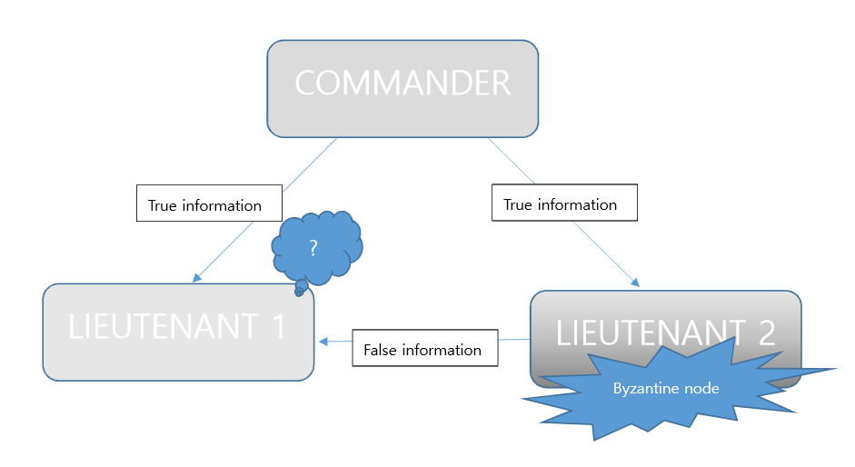
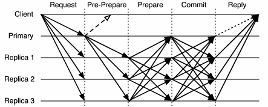

<h2>PBFT 기초<h2/>

<h4>분산 시스템 오류</h4> 

<ul>
<li> Fail-stop</li>
	
노드들이 서로 충돌 가능하지만 충돌 시 다른 노드들이 충돌했음을 발견 가능,값을 return 하지는 않는다.	
<li> Byzantine fault</li>
	
Fail-stop 처럼 노드들이 서로 충돌 가능하지만, 충돌했을 때 다른 노드들이 발견하기 쉽지 않고, 
  잘못된 정보나 충돌된 정보를 return 한다.
</ul>

<h4>Byzantine 오류란?</h4>

전체 네크워크의 노드의 수가 3개라고 가정을 해보았을 때, 그 중 commander 역할을 하는 노드가 1개 존재하게 된다. 
Commander 노드는 투표가 가능한 선지를 제공하여 나머지 Lieutenant 노드들이 투표를 할 수 있게 한 후, 그 결과를 반영하여 행동을 결정하는 역할을 한다. 
이 3개의 노드가 모두 올바른 정보를 서로에게 제공한다면 3개의 노드는 consensus에 도달할 수 있게 된다. 
그러나 3개의 노드 중 외부의 영향으로 인해 거짓된 정보를 제공하거나 합의점에 도달하는 것을 방해하는 정보를 
제공하는 노드가 있을 수 있다. (Byzantine 노드는 없을 수도, 1개일수도, 그 이상일 수도 있다.) 이 때 이 노드를 
Byzantine 노드라고 한다. 이 Byzantine 노드로 인해 오류가 발생하게 된다. 

만약 Byzantine 노드가 1개라면 나머지 2개의 노드 중 1개는 거짓된 정보와 올바른 정보를 같이 제공받게 되어 혼란이 일어나게
 된다. 이 때 어느 쪽이 올바른 정보인지를 알 방법이 없기 때문에 오류가 발생한다. 

위의 예시를 확장하여 PBFT에 대해 알아보도록 하자. 

<h4>PBFT</h4>

PBFT는 분산시스템이 Byzantine 노드가 존재 할 수 있는 비동기 시스템일 때 해당 분산시스템에 
 참여한 모든 노드가 성공적으로 합의를 이룰 수 있도록 개발된 합의 알고리즘이다. 기존의 BFT 합의 알고리즘이 동기식 
 네트워크에서만 합의가 가능했던 문제를 합의하여 Byzantine 노드가 있는 비동기 네크워크에서도 합의할 수 있게 하였다.

 

PBFT는 전체 네크워크 노드의 수가 3*F+1 일때, F개의 Byzantine 오류를 방어할 수 있다는 가정을 하고 있다. 
 오류를 방어한다는 말은 Byzantine 오류가 나지 않고 제대로 된 값을 return하는 것을 의미한다. PBFT는 client가 
 첫번째 노드에게 request를 보냈을 때 시작된다. 이 첫번째 노드는 client가 요청한 모든 transaction을 모아 블록을 
 만든다. 그 다음 3단계를 거쳐 consensus에 이르게 된다.

<h4>PBFT 주요 3단계</h4>

<ul>
<li> Pre prepare</li>
	
Client의 요청을 받은 첫번째 노드가 네트워크에 있는 모든 노드에게 블록을 전달하고(pre prepare 메세지를 보내고),

모든 노드들이 그 블록을 받게 된다. Pre prepared 메세지에는 노드들이 메세지의 유효성을 검증할 수 있는 signiture나 다른 meta data, sequence number가 들어 있다.   
	
<li> Prepare</li>
	
모든 노드들이 블록을 받게 되면 블록을 받은 노드가 나머지 모든 노드들에게 자신이 블록을 받았다는 prepare 메세지를 보내게 된다. 각 노드는 다른 노드들이 블록을 받았는지 여부를 취합하여 이 수가 2/3 이상일 때 블록을 검증한다. 

 (Prepare 메세지는 그 메세지를 보낸 노드가 현재 유효하다는 것을 알려준다.)   
	
<li> Commit</li>
	
그 후 검증 결과값을 모든 노드에 전파한다. 각 노드는 다른 노드들이 보내준 블록 유효성 검증 결과값을 취합하며, 전체의 2/3 초과하여 동일한 결과값을 보냈을 경우 해당 결과값을 참으로 인식한다. 
	
-검증 결과값이 2/3를 초과한 노드가 블록이 유효하다는 결과값을 보냈을 때, 블록을 자신의 블록체인에 추가한다.
	
-1/3 이상의 노드가 블록이 유효하지 않다는 결과값을 보냈을 때, 블록을 블록체인에 추가하지 않는다.
	
이 과정이 끝나면 현재 상태를 client에게 reply 해준다.
	</ul>
	

