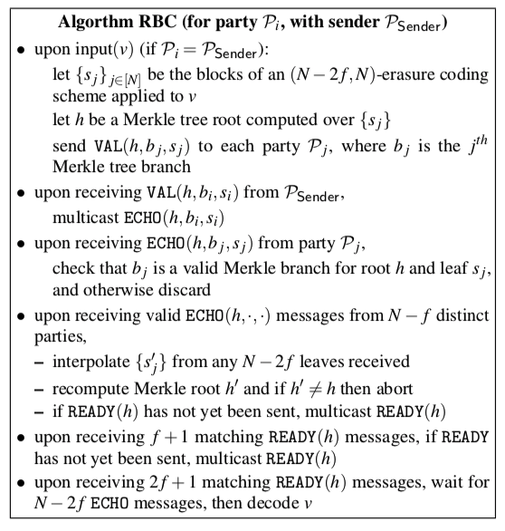

# RBC : Reliable Broadcast

### Overview

The typical Broadcast, which depends on implementation, does not guarantee message delivery and does not consider situations in which the sender is crash (the situation in which the message cannot be sent to all). However, the RBC guarantees message delivery and partially solves the situation where the sender crashes. 

In this [paper](<https://eprint.iacr.org/2016/199.pdf>), the Atomic Broadcast is introduced. This is a Broadcast that guarantees the situation of the sender crash and the order of messages. And this Atomic Broadcast is called the **RBC** in HBBFT.

[The paper](<https://eprint.iacr.org/2016/199.pdf>) shows ABC (Atomic Broadcast) as ACS (Asynchronous Common Subset) using `threshold encryption` and ACS consists of RBC and BBA (Binary Byzantine Agreement) components. Among them, RBC performs reliable broadcasting and BBA is responsible for sequence of consensus and atomic messages.

HBBFT does not send the entire data but sends the pieces by dividing the data by the number of nodes in the network. For this purpose, RBC uses a technique called `erasure coding`.

### Erasure Coding   

Erasure coding is one of FEC (Forward Error Correction) methods and it can perform error detection and error correction. In RBC, Reed-solomon technique is used among erasure coding techniques. It splits the original data into `n pieces` and adds `k parities`. Then, even if a maximum of k data is lost, original data can be recovered if only n data are survived. Good Examples and detailed explanations can be found [here](<https://www.backblaze.com/blog/reed-solomon/>).

### RBC Algorithm

        </img>

Assume that the content to be agreed on the network is Block.

- There are N nodes on the network.

- Split a block into N pieces. And erasure coding to generate N-2f parity.
- The message to be delivered consists of `VAL(h, b(j), s(j))`. (`h`: Merkle tree root of `s(j)`, `b(j)`: Merkle tree branch of `s(j)`, `s(j)`: A fragment)

1. When receiving `VAL(h, b(i), s(i))` from `P(sender)`, it multicasts `ECHO(h, b(i), s(i))` to the node except the sender and itself.
2. When `ECHO(h, b(j), s(j))` is received from `P(j)`, check whether `h` is valid using merkle information `s(j)` and `b(j)`. If it is not valid, discard it.
3. When receiving a valid `ECHO` from an `N-f` node
   - Interpolate `s(j)` from `N-2f` leaves.
   - Identify the interpolated merkle root. If it is not valid, discard it.
   - If you have not yet sent `READY(h)`, multicast `READY(h)`.

4. If you have received `f + 1` messages that match the `READY(h)` message and you have not yet sent `READY`, multicast `READY`.
5. Upon receipt of a `2f + 1` message that matches the `READY(h)` message, wait for `N-2f` `ECHO` messages and decode `VALUE`.

> `READY(h)` is condition when receving a valid `ECHO` from an `N-f` node

And the RBC should satisfy the following.

- Agreement : If any two correct nodes deliver *v* and *v*′, then *v* = *v*′. 
- Totality : If any correct node delivers *v*, then all correct nodes deliver *v*
- Validity : If the sender is correct and inputs *v*, then all correct nodes deliver *v* 